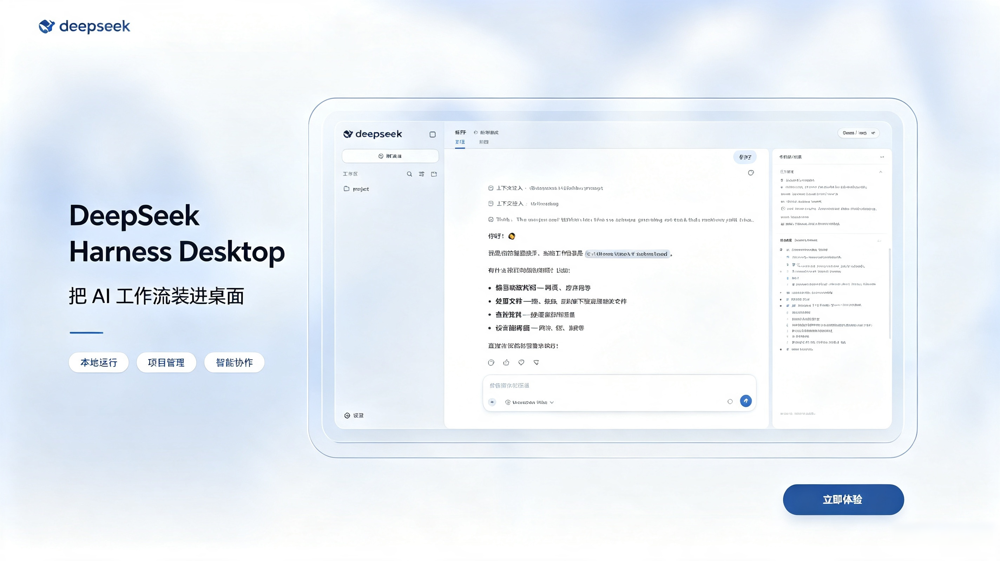
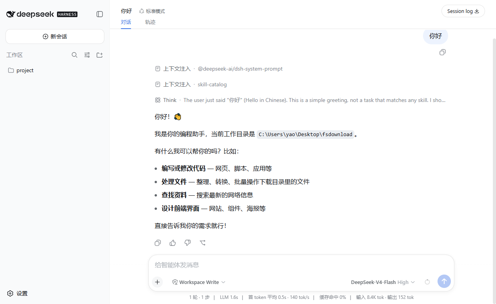

<div align="center">
  
  <h1>DeepSeek Harness Desktop</h1>
  <p>基于 Electron 39 + Vue 3 + Naive UI 构建的 DeepSeek Harness 桌面客户端</p>
  <p>
    <a href="README.md">English</a> &nbsp;|&nbsp; 简体中文
  </p>
  <p>
    
    
    
    
    
  </p>
</div>

---

## 项目定位

DeepSeek Harness Desktop 是一款基于 **Electron 39 + Vue 3 + Naive UI** 技术栈构建的跨平台桌面客户端，采用 ElectronEgg（ee-core）框架组织主进程生命周期与 IPC 自动加载。应用内置 Node.js 24.18.1 LTS 运行时，将官方 `@deepseek-ai/dsh` 以子进程方式托管，并在沙箱化的 BrowserWindow 中加载其 `dsh web` 界面。

与直接通过 `npx @deepseek-ai/dsh web` 运行相比，本项目把「装 Node、配 npm、开终端、管进程」这一整套流程封装成了一个普通桌面应用，用户双击即可使用。

> 本项目为社区独立维护，与 DeepSeek 官方无任何隶属关系。应用不修改官方 DSH 的代码、数据与行为，DSH 按其自身许可证运行。





## 核心特性

### 运行时托管

- **内置 Node.js 24.18.1 LTS**：随应用打包，用户无需自行安装 Node.js 环境
- **进程隔离**：DSH 作为独立子进程运行，应用退出时自动回收
- **端口随机分配**：DSH 监听 `--port 0`，从 stdout 解析实际地址，避免端口冲突

### 版本管理

- **多版本共存**：每个版本独立目录，支持任意历史版本安装与切换
- **原子安装**：npm install 先写入 staging 目录，校验通过后原子重命名，避免半成品被识别为已安装
- **实时安装进度**：流式输出 npm 日志到前端，告别黑盒等待

### 镜像源切换

- **一键切换**：内置 npm 官方源与国内 npmmirror 镜像源切换
- **持久化保存**：偏好写入用户数据目录，应用重启后自动恢复
- **双通道同步**：版本目录查询与 npm install 共用同一 registry URL

### 系统托盘驻留

- **关闭即隐藏**：点窗口 x 号不退出应用，隐藏到托盘，DSH 进程继续运行
- **托盘菜单**：DeepSeek Harness / 版本管理 / 退出 三项
- **状态指示**：托盘 tooltip 实时反映 DSH 运行状态与版本号

### 双语界面本地化

- **中英一键切换**：界面、菜单、托盘、错误提示、通知全部本地化
- **跟随系统**：可选择 locale 跟随系统语言，应用启动时自动适配

### 应用自更新

- **DSH 更新**：版本列表标出最新版，点「更新到 vX.X.X」一步到位
- **应用更新**：通过 GitHub Releases 检查应用自身新版本

## 架构概览

```
┌─────────────────────────────────────────────────────────┐
│                    渲染进程 (Vue 3)                       │
│                                                          │
│  ┌──────────────────────────────────────────────────┐   │
│  │  版本管理器 (Naive UI)                            │   │
│  │  - 版本卡片网格 / 安装进度 / 镜像源切换 / 语言切换 │   │
│  │  - 响应式状态管理 (reactive)                      │   │
│  │  - i18n 中英文文案                               │   │
│  └──────────────────────────────────────────────────┘   │
└────────────────────────┬────────────────────────────────┘
                         │ contextBridge (受控 API)
                         │ window.dshDesktop.*
┌────────────────────────▼────────────────────────────────┐
│                  主进程 (Electron 39)                    │
│                                                          │
│  ┌─────────────┐  ┌──────────────┐  ┌────────────────┐ │
│  │ 内置 Node.js │  │ 版本管理器    │  │ 进程监控        │ │
│  │ 24.18.1 LTS      │  │ npm install  │  │ spawn dsh web  │ │
│  │             │  │ 切换 / 校验   │  │ 解析端口        │ │
│  └─────────────┘  └──────────────┘  └────────────────┘ │
│                                                          │
│  ┌─────────────┐  ┌──────────────┐  ┌────────────────┐ │
│  │ 系统托盘     │  │ 应用自更新    │  │ IPC 注册中心    │ │
│  │ 菜单 / tooltip│  │ electron-    │  │ ipcMain.handle │ │
│  │             │  │ updater      │  │                │ │
│  └─────────────┘  └──────────────┘  └────────────────┘ │
└────────────────────────┬────────────────────────────────┘
                         │ BrowserWindow.loadURL
                         │ http://127.0.0.1:随机端口
┌────────────────────────▼────────────────────────────────┐
│              DSH 业务窗口 (sandbox 隔离)                 │
│                                                          │
│  官方 dsh web 页面                                       │
│  - contextIsolation: true                                │
│  - sandbox: true                                         │
│  - 不暴露 Electron / Node.js API                         │
└─────────────────────────────────────────────────────────┘
```

主进程通过 `contextBridge.exposeInMainWorld` 暴露受控 API（`window.dshDesktop`）给版本管理器渲染进程；DSH 业务窗口只加载本地 127.0.0.1 地址，无任何预加载脚本注入。

## 技术栈

| 层 | 技术 | 用途 |
| --- | --- | --- |
| 桌面框架 | Electron 39 | 跨平台桌面运行时 |
| 应用框架 | ee-core (ElectronEgg) | 主进程生命周期、IPC 自动加载、配置分层 |
| 前端框架 | Vue 3 + Vite | 渲染进程 UI 与热更新 |
| UI 组件库 | Naive UI | 版本管理器界面组件 |
| 运行时 | Node.js 24.18.1 LTS | 内置运行 DSH 子进程 |
| 状态管理 | Vue reactive | 轻量响应式（无 Pinia） |
| 版本比较 | semver | DSH 版本号校验与排序 |
| 应用更新 | electron-updater | GitHub Releases 检查与安装 |
| 持久化 | write-file-atomic | 配置文件原子写入 |
| 进程管理 | child_process.spawn | DSH 子进程启停与 stdout 监听 |

## 使用指南

### 启动 DSH

1. 打开应用，进入版本管理页面
2. 在版本卡片网格中选择一个已安装的 DSH 版本（最新已安装版本默认选中）
3. 点击「启动 DSH」按钮，应用通过内置 Node.js 启动 `dsh web` 子进程
4. 启动成功后，DeepSeek Harness 工作区在独立窗口中打开，主窗口自动隐藏到系统托盘

### 版本管理

- **安装新版本**：点击版本卡片上的「安装」按钮，应用通过 npm 下载官方包到用户数据目录，安装过程实时显示 npm 输出
- **切换版本**：已安装版本间一键切换，切换前需先停止运行中的 DSH
- **镜像源切换**：顶部工具栏切换 npm 官方源 / 国内镜像源（npmmirror），国内用户建议使用镜像源加速
- **快速更新**：检测到新版本时，顶部出现「更新到 vX.X.X」按钮，点击安装或切换

### 托盘菜单

应用启动后在系统托盘显示图标，右键菜单包含三项：

| 菜单项 | 作用 |
| --- | --- |
| DeepSeek Harness | 显示 DSH 业务窗口（DSH 运行时可用） |
| 版本管理 | 显示版本管理器主窗口 |
| 退出 | 退出应用，自动停止运行中的 DSH 进程 |

单击托盘图标：优先显示 DSH 业务窗口，否则显示主窗口。

## 下载安装

前往 [GitHub Releases](https://github.com/westhack/deepseek-harness-desktop/releases/latest) 下载对应系统的安装包：

| 系统 | 安装包 |
| --- | --- |
| macOS Apple Silicon | `*-arm64.dmg` |
| macOS Intel | `*-x64.dmg` |
| Windows 10/11 x64 | `*-Setup-x64.exe` |

DSH 安装位置（不污染全局环境）：

| 系统 | 路径 |
| --- | --- |
| macOS | `~/Library/Application Support/dsh-desktop/dsh-versions/` |
| Windows | `%APPDATA%\dsh-desktop\dsh-versions\` |

每个版本独立子目录，删除目录即卸载该版本。

## 本地开发

### 环境要求

- Node.js 22.19+ 或 24+
- npm 10+
- macOS 11+ 或 Windows 10+

### 开发模式

```bash
npm install
npm run prepare:runtime   # 下载内置 Node.js 24 和随包 DSH
npm run dev               # 启动 Electron + 前端热更新
```

### 打包构建

```bash
npm run build-m-arm64     # macOS Apple Silicon
npm run build-m           # macOS Intel
npm run build-w           # Windows x64
```

构建产物输出到 `build/out/`。

## 目录结构

```
electron-egg/
├── electron/                          # Electron 主进程
│   ├── config/
│   │   └── config.default.js          # 应用配置（sandbox、窗口、生命周期）
│   ├── preload/
│   │   ├── bridge.js                  # DSH API 桥接（contextBridge 暴露受控 API）
│   │   └── lifecycle.js               # 应用生命周期预加载
│   ├── service/
│   │   ├── dsh/
│   │   │   ├── manager.js             # 主管理器：窗口、托盘、菜单、IPC 注册
│   │   │   ├── controller.js          # 业务编排：版本选择、启停、镜像源切换
│   │   │   ├── version-manager.js     # npm install、版本解析、原子安装
│   │   │   ├── dsh-supervisor.js      # DSH 子进程 spawn、stdout 解析、退出处理
│   │   │   ├── registry.js            # npm 版本目录查询
│   │   │   ├── state-store.js         # 配置持久化（write-file-atomic）
│   │   │   ├── runtime-paths.js       # 内置 Node.js 路径解析
│   │   │   ├── network-proxy.js       # 网络代理探测与配置
│   │   │   └── menu-copy.js           # 中英文菜单与托盘文案
│   │   └── desktop-updater.js         # 应用自更新（electron-updater）
│   └── shared/
│       ├── contracts.js               # 共享常量与校验（版本号、locale、registry）
│       └── ipc-channels.js            # IPC 通道常量定义
├── frontend/                          # Vue 3 前端
│   └── src/
│       ├── views/dsh/
│       │   └── Manager.vue            # 版本管理器页面（Naive UI）
│       ├── store/dsh.js               # 响应式状态管理
│       ├── utils/i18n.js              # 中英文案与本地化工具
│       └── router/                    # 路由配置
├── public/                            # 静态资源（logo 等）
├── build-resources/                   # 构建资源（内置 Node.js、随包 DSH）
└── scripts/                           # 构建辅助脚本
```

## 产品边界

本项目仅承担运行时管理、版本管理与进程托管职责，不会：

- fork、patch、重新编译或向官方 DSH 页面注入代码
- 管理 API Key、模型、会话、插件、Skills 或 MCP 配置
- 读取、迁移、备份或删除 DSH 的用户数据
- 自动升级或强制替换用户主动选择的 DSH 版本
- 将本地 DSH 服务暴露到局域网或公网（仅监听 127.0.0.1）

## 许可证

[MIT](LICENSE)

## 致谢

- [DeepSeek](https://www.deepseek.com/) — 官方 DeepSeek Harness 的开发者
- [ElectronEgg](https://github.com/wallace5303/electron-egg) — 桌面应用开发框架
- [Vue.js](https://vuejs.org/) & [Naive UI](https://www.naiveui.com/) — 前端框架与组件库
